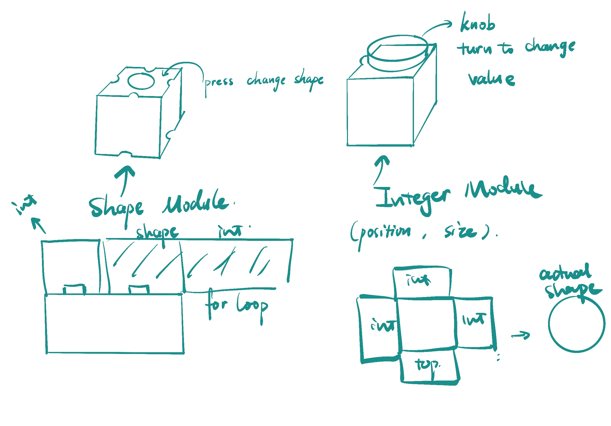
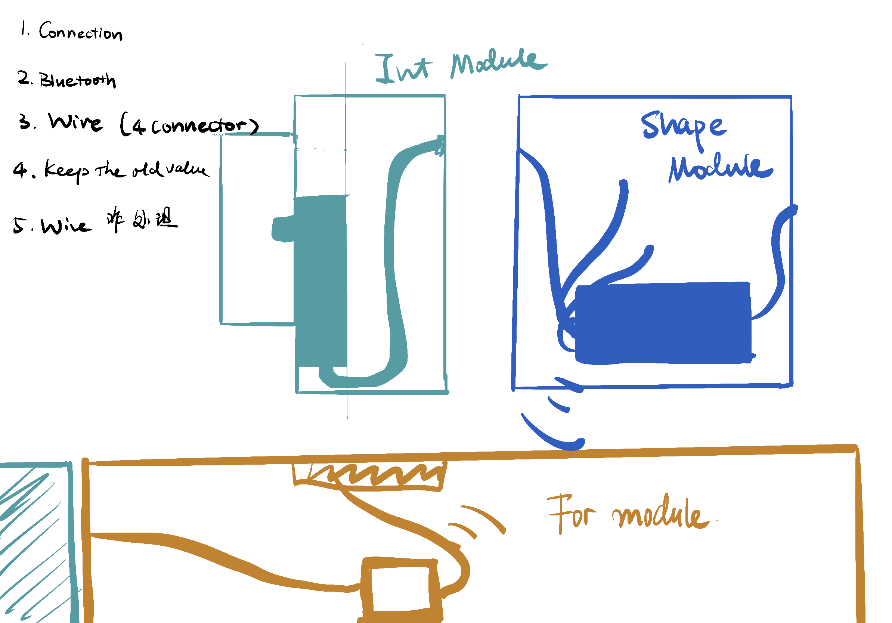
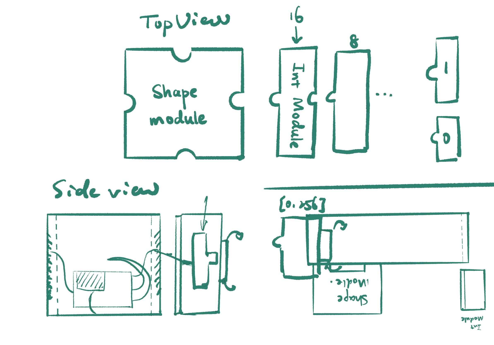
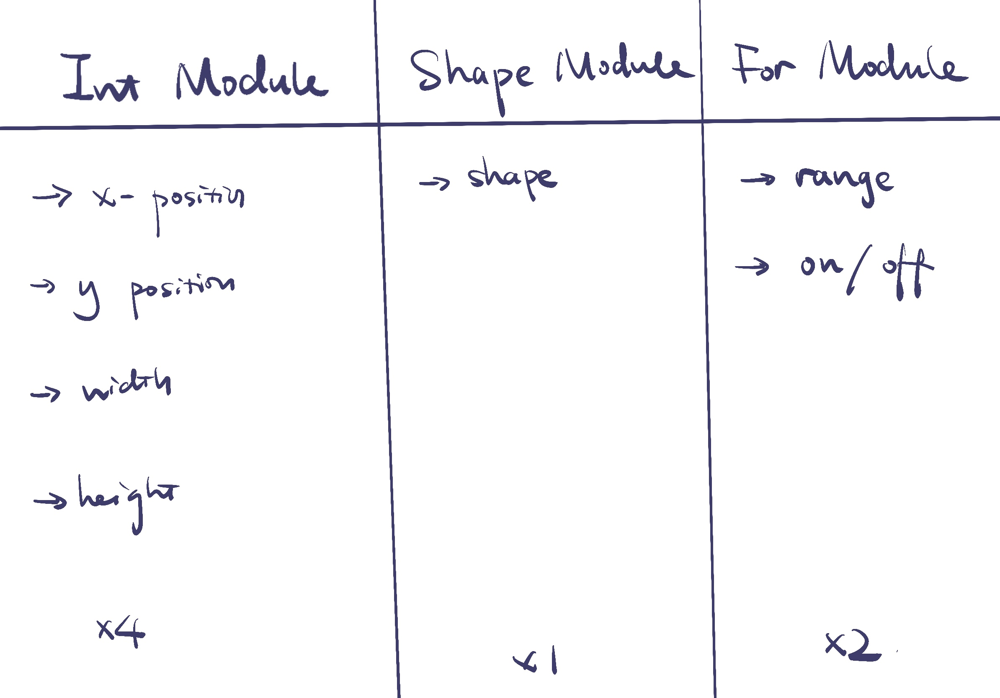
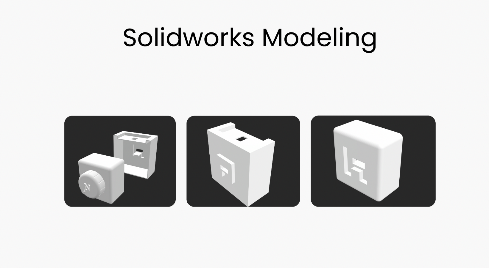

This is my Github
# FINAL PROJECT - CodeBlock

## Project Brief

A Modular Programming Prototyping Kit that could help users to interact and learn about p5.js. 
The Kit includes Value Modular, Shape Modular, and For Loop Modular. The user could connect Value Modular with SHape Modular to change the position, size. Also Connect Value Moduler and Shape Modular with For Loop Modular to run the for loop

## Project OutCome

Prototype: https://youtu.be/meJKi2kt-As

## Project Ideation








## Project Process

### Hardware
- Atom3 Board * 2
- Potentiometer * 5
- light sensor * 1
- wire * n

Wireconnection of Value Module
  

Wireconnection of Shape Module
Specially, due to the limitation of the input on Atom3, I modified the wire and connected to pin1,2,6,8
  
  

Wireconnection of For Loop Module
  

### Firmware
This project includes bluetooth communication of two atom3 board, and atom3 board send data to the web. 

[Bluetooth Connection](thonny/bluetooth.py)

The bluetooth imported and use .write() method to send data of for_modlue_value, which is a Potentiometer value shows the number of loops. and light sensor value, which tells whether shape module is connected to the for loop module. It sent those 2 datas to other atom 3 board

```
  for_module_value = for_module.read()
  light_module_value = light_module.read()
  #print('write to bleuart..')
  print(str(for_module_value)+ "," +str(light_module_value))
  #ble_server.write('hello M5!')
  ble_server.write(str(for_module_value)+ "," +str(light_module_value))`
```

Main.py mainly get the value of x,y position as weel as size by Potentiometer, also change different size

In the main.py, the shape_value could be changed to swith between different shapes,add times to avoid click the screen once but change multiple times of shape.
```
  if time.ticks_ms() > button_timer + 200:
    button_timer = time.ticks_ms()  # update button_timer
 # update button_timer
    if button_value == 0: #switch between different shape
      if shape_value == "Rect":
        shape_value = "Hex"
      elif shape_value == "Hex":
        shape_value = "Oct"
      elif shape_value == "Oct":
        shape_value = "Cir"
      else:
        shape_value = "Rect"
```

In the pyscipt, it reads the value from atom3 by split the print statement according to ",". It will return a list and each value is different elements in the list

```
  data_string = document.getElementById("data").innerText
  # # split data_string by comma, making a list:
  data_list = data_string.split(',')
  if(len(data_list)>5): # the bluetooth sometimes have delay, so it wouln't have 7 datas. Use this line to prevent the error message when bluetooth has delay. 
    position_x = int(data_list[0])
    position_y = int(data_list[1])
    value_x = int(data_list[2])
    value_y = int(data_list[3])
    shape_value = str(data_list[4])
    for_value = int(data_list[5])
    for_state = data_list[6]
```

Then, draw the shape according to the value. 
Use the if statement to seperate whether the shape module is in touch with for loop
```
if(for_state == "On"):
```
Using if statement to seperate different shapes it going to draw. Map the Potentiometer to the canvas by deviding (it could also be using map_value function)
translate and rotate the shape inside for loop 
use push and pop each time.
```
     for i in range (int(for_value /200)) : 
      p5.push()
      p5.rotate(p5.PI*2 / int(for_value /200) * i)
      p5.translate((position_x - 2000)/2,(position_y- 2000)/5)
      if(shape_value == "Rect"):
        p5.rect(0, 0, value_x / 4, value_y / 8)
      elif(shape_value == "Hex"):
        polygon(0, 0, value_x / 4, 6)
      elif(shape_value == "Oct"):
        polygon(0, 0, value_x / 4, 8)
      else:
        p5.ellipse(0,0,value_x /4, value_y / 5)
     p5.pop()
```
Same with out for loop
```
  else:
    p5.translate((position_x - 2000)/2,(position_y- 2000)/5)
    if(shape_value == "Rect"):
      # print(value_x)
      p5.rect(0, 0, value_x / 4, value_y / 8)
    elif(shape_value == "Hex"):
        polygon(0, 0, value_x / 4, 6)
    elif(shape_value == "Oct"):
        polygon(0, 0, value_x / 4, 8)
    else:
        # print(shape_value)
        p5.ellipse(0,0,value_x / 4, value_y / 8) 

  p5.pop()


```


Specially, there is a function for draw hexagon / other polygon shape:

```
def  polygon(x, y, radius, npoints):
  angle = p5.PI*2 / npoints
  p5.beginShape()
  i = 0
  while(i<p5.PI*2):
   
    sx = x + p5.cos(i) * radius
    sy = y + p5.sin(i) * radius
    p5. vertex(sx, sy)
    i += angle
  
  p5.endShape(p5.CLOSE)
```

### Enclosure / Mechanical Design
This project shapes are build in Solidworks. The idea is instead of connect the wire, the user could connect the shape and that makes the wire connected. So I design an N shape for Value Module that could be connected to the shape module and for loop module 

